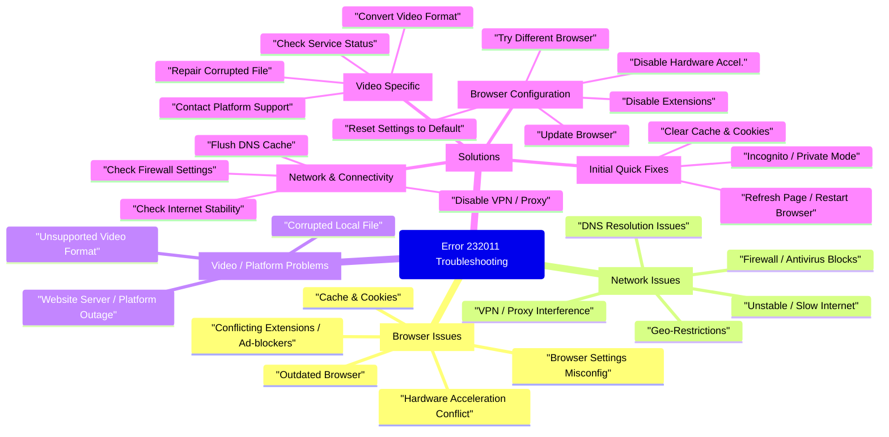

# Unraveling Error Code 232011: Your Ultimate Guide to Restoring Video Playback

### Don't let "This Video Cannot Be Played" halt your entertainment or productivity. Discover comprehensive solutions to conquer Error Code 232011.

1. [Highlights for Troubleshooting Video Playback](#highlights-for-troubleshooting-video-playback)
2. [Deciphering the Origins of Error Code 232011](#deciphering-the-origins-of-error-code-232011)
3. [A Step-by-Step Guide to Resolving Error Code 232011](#a-step-by-step-guide-to-resolving-error-code-232011)
4. [Consolidated Troubleshooting Steps](#consolidated-troubleshooting-steps)
5. [Prioritizing Solutions: A Strategic Approach](#prioritizing-solutions-a-strategic-approach)
6. [Visualizing the Troubleshooting Flow](#visualizing-the-troubleshooting-flow)
7. [Frequently Asked Questions (FAQ)](#frequently-asked-questions-faq)
8. [Conclusion: Restoring Your Viewing Experience](#conclusion-restoring-your-viewing-experience)
9. [Recommended Further Exploration](#recommended-further-exploration)
10. [Referenced Search Results](#sources)

---

Highlights for Troubleshooting Video Playback
---------------------------------------------

* **Start Simple:** Often, a quick refresh, clearing browser cache and cookies, or trying Incognito/Private mode can resolve the issue, addressing common browser-related glitches.
* **Systematic Approach:** If simple fixes don't work, progressively troubleshoot by disabling extensions, hardware acceleration, or resetting browser settings before considering more advanced solutions like network adjustments or video file repair.
* **Beyond the Browser:** Remember that internet connection stability, VPN/proxy interference, and even corrupted video files or website-specific problems can contribute to Error Code 232011, requiring a broader diagnostic perspective.

Encountering "Error Code 232011: This Video Cannot Be Played" can be a source of significant frustration, whether you're trying to unwind with a movie, catch up on a lecture, or collaborate on a project. This prevalent error message signals that your browser or media player is unable to process or display the video content. The root causes can vary widely, from minor browser annoyances to more complex network or file integrity issues. Fortunately, a systematic approach to troubleshooting can help you identify and resolve the problem, restoring your ability to watch videos seamlessly.

This comprehensive guide will walk you through every known solution for Error Code 232011, ensuring you have all the tools at your disposal to tackle this common annoyance. We'll explore browser-specific fixes, network diagnostics, and even considerations for corrupted video files, equipping you with the knowledge to get your videos playing again.

---

Deciphering the Origins of Error Code 232011
--------------------------------------------

Before diving into the fixes, it's beneficial to understand why Error Code 232011 occurs. Pinpointing the potential cause can guide your troubleshooting efforts and lead to a quicker resolution. The error typically arises from one or more of the following categories:

* **Browser-Related Issues:** This is the most common category, encompassing everything from accumulated cache and cookies to conflicting extensions or outdated browser versions.
* **Network Connectivity Problems:** An unstable or slow internet connection, or interference from VPNs and proxy servers, can prevent video data from loading correctly.
* **Hardware and Software Conflicts:** Features like hardware acceleration, while generally beneficial, can sometimes cause compatibility issues with video playback on certain systems.
* **Video File or Platform Issues:** Less commonly, the problem might lie with the video file itself (if it's corrupted) or with the streaming platform experiencing an outage or specific content restrictions.

Let's illustrate the typical impact levels of these causes:

<RadarChart id="radarCanvas" />

*The radar chart above illustrates a general assessment of the frequency of common causes for Error Code 232011 and the relative ease of applying fixes. Browser cache issues are frequent and easy to fix, while corrupted files are less common and more challenging.*

---

A Step-by-Step Guide to Resolving Error Code 232011
---------------------------------------------------

The key to resolving Error Code 232011 is to follow a systematic approach, starting with the simplest and most common solutions before moving to more complex ones. Here are all the options to help you fix the issue:

### Initial Troubleshooting Steps: Quick Fixes First

Before diving deep, always start with these basic steps. They often resolve temporary glitches quickly and efficiently.

#### Refresh the Page or Restart Browser

Sometimes, the simplest solutions are the most effective. A temporary loading error or a minor browser glitch can be resolved by merely refreshing the webpage. If that doesn't work, close your browser completely and reopen it. This clears any lingering processes that might be interfering with video playback.

#### Clear Browser Cache and Cookies

Over time, your browser accumulates cached data and cookies, which can become corrupted or outdated. These files can interfere with how videos are loaded and played. Clearing them is a fundamental troubleshooting step.

* **Google Chrome:** Go to Settings > Privacy and security > Clear browsing data. Select "Cookies and other site data" and "Cached images and files," choose "All time," and click "Clear data."
* **Mozilla Firefox:** Navigate to Options > Privacy & Security > Cookies and Site Data > Clear Data. Ensure both "Cookies and Site Data" and "Cached Web Content" are selected, then click "Clear."
* **Other Browsers (Edge, Safari, Opera):** The process is similar. Look for "Clear browsing data," "History," or "Privacy" settings in your browser's menu.

*Clearing your browser's cache and cookies is a fundamental step to remove potentially corrupted data causing playback issues.*

#### Utilize Incognito or Private Browsing Mode

Incognito (Chrome) or Private (Firefox, Edge, Safari) browsing mode offers a clean slate. It typically disables most browser extensions and prevents the use of existing cached data and cookies. If a video plays successfully in this mode, it strongly suggests the problem lies with either your browser extensions or accumulated data in your regular browsing session.

* **Chrome:** Press Ctrl+Shift+N (Windows/Linux) or Command+Shift+N (Mac).
* **Firefox:** Press Ctrl+Shift+P (Windows/Linux) or Command+Shift+P (Mac).

### Browser Configuration Adjustments

If the initial steps don't work, delve into your browser's settings. Conflicts with extensions or specific rendering options can be the culprit.

#### Disable Browser Extensions and Ad Blockers

Many browser extensions, particularly ad blockers, privacy tools, or script blockers, can inadvertently interfere with video players on websites. Temporarily disabling them can help isolate the issue.

* Access your browser's extensions/add-ons manager (e.g., `chrome://extensions` for Chrome, `about:addons` for Firefox).
* Temporarily disable all extensions.
* Refresh the video page and test playback.
* If the video plays, re-enable extensions one by one to identify the specific one causing the conflict. You may then need to keep it disabled, whitelist the problematic site, or find an alternative.

#### Disable Hardware Acceleration

Hardware acceleration uses your computer's graphics processing unit (GPU) to handle video decoding, which is usually efficient. However, it can sometimes lead to conflicts or playback issues due to driver incompatibilities or specific browser versions.

* **Chrome:** Go to Settings > System and toggle off "Use hardware acceleration when available." Relaunch Chrome.
* **Firefox:** Navigate to Options > General > Performance. Uncheck "Use recommended performance settings," then uncheck "Use hardware acceleration when available." Restart Firefox.

#### Update Your Browser

An outdated browser might lack critical bug fixes, security patches, or compatibility improvements necessary for modern video formats and streaming protocols. Ensuring your browser is up-to-date is crucial for optimal performance and security.

* Most browsers allow you to check for updates through their "About" section (e.g., Chrome: Settings > About Chrome; Firefox: Help > About Firefox).
* Allow the browser to check for and install any available updates, then restart it.

#### Reset Browser Settings to Default

If multiple configurations or extensions have been installed over time, your browser's settings might have become complex or corrupted in ways that are hard to pinpoint. Resetting them to their original defaults can resolve these deeper misconfigurations without deleting essential data like bookmarks or saved passwords.

* **Chrome:** Go to Settings > Reset settings > Restore settings to their original defaults.
* **Firefox:** Go to Help > More troubleshooting information > Refresh Firefox.

#### Try a Different Browser

Sometimes, the issue is specific to a particular browser, perhaps due to a unique bug or a temporary incompatibility. Switching to an alternative browser (e.g., Edge, Firefox, Chrome, Safari, Opera) for a quick test can immediately tell you if the problem is localized to your primary browser or more widespread.

### Network and Connectivity Solutions

Problems with your internet connection or network settings can significantly impact video streaming. These solutions address potential hindrances in data delivery.

#### Check Your Internet Connection

A slow, unstable, or interrupted internet connection is a common cause of video playback errors. Videos require a consistent stream of data to play smoothly. Without it, you'll encounter buffering or error messages.

* **Restart Your Router/Modem:** Unplug your router and modem from power for 30 seconds, then plug them back in. This can refresh your connection and resolve temporary network glitches.
* **Run a Speed Test:** Use an online internet speed test (e.g., Speedtest.net) to verify your bandwidth. Ensure it meets the recommended speeds for streaming video content (typically 5-25 Mbps for HD to 4K).
* **Switch to a Wired Connection:** If you're on Wi-Fi, try connecting your device directly to the router with an Ethernet cable. This eliminates potential wireless interference.

#### Test on Another Device or Network

Isolating the source of the problem helps you quickly determine whether the playback error is tied to your current device or network environment.

* **Try a Different Device:** Attempt to play the same video on another device (for example, a phone or a second computer) while remaining on the **same network**. If the video works, your original device may have a configuration or software issue.
* **Change Networks:** Using the **same device**, connect to an alternative network such as mobile data, a personal hotspot, or a different Wi-Fi. Successful playback here typically points to a network-specific problem (e.g., router settings, ISP throttling, or local firewall rules).

If either of these tests resolves the issue, you've effectively narrowed down the root cause, allowing you to focus your troubleshooting efforts on the affected device or network.

#### Disable VPN or Proxy Services

Virtual Private Networks (VPNs) and proxy servers encrypt and re-route your internet traffic, which can sometimes interfere with content delivery networks (CDNs) that stream videos. Temporarily disabling these services can resolve connection-related playback issues.

* Turn off any active VPN software or browser extensions.
* Disable proxy settings in your system's network configuration.
* Reload the video page and test playback.

#### Reset DNS Settings or Flush DNS Cache

Your Domain Name System (DNS) server translates website names into IP addresses. Corrupted DNS cache or inefficient DNS settings can prevent your browser from properly locating video content. Flushing your DNS cache clears old entries, and switching to a public DNS can provide a more reliable connection.

* **Flush DNS Cache (Windows):** Open Command Prompt as an administrator and type `ipconfig /flushdns`.
* **Switch to Public DNS:** Consider using Google's Public DNS (8.8.8.8 and 8.8.4.4) or Cloudflare's (1.1.1.1 and 1.0.0.1) in your network adapter settings.

### Addressing Video File and Platform Specifics

In some cases, the problem isn't with your browser or network, but with the video content itself or the platform hosting it.

#### Repair Corrupted Video Files (Local Files)

If you're encountering Error Code 232011 with a video file stored locally on your computer (not streaming online), the file itself might be corrupted or damaged during download or transfer. In such scenarios, specialized video repair software can be helpful.

* Try playing the file in multiple media players (e.g., VLC Media Player, Windows Media Player, QuickTime) to confirm it's a file-specific issue.
* Utilize video repair tools like Wondershare Repairit, 4DDiG File Repair, or EaseUS Fixo Video Repair. These applications are designed to mend broken or unplayable video files.

#### Check Video Format Compatibility

While less common with modern browsers, some older browsers or specific media players might not support certain video codecs or file formats. Most web videos use MP4 (H.264 codec), but if you're dealing with a less common format, compatibility could be an issue.

* If possible, try to convert the video to a widely supported format like MP4 using a video converter tool.
* Ensure your operating system has the necessary codec packs installed if you are playing local files with a system media player.

#### Examine Content Restrictions or Website Issues

Sometimes, the problem isn't on your end. The website hosting the video might be experiencing server issues, or there could be regional content restrictions preventing playback.

* **Check Other Videos:** Try playing other videos on the same website. If they also fail, the issue might be with the website itself.
* **Check for Service Outages:** Look for official announcements from the streaming service or website on their social media channels or status pages.
* **Regional Restrictions:** If content is geo-restricted, you might need to use a VPN to access it (though be aware of the potential VPN-related issues mentioned earlier).

#### Network and Firewall Settings

Your computer's firewall or antivirus software might be overly restrictive, blocking necessary connections for video streaming. Temporarily disabling them can help diagnose if they are the cause.

* **Temporarily Disable Firewall/Antivirus:** Access your security software settings and momentarily disable the firewall or real-time protection. Remember to re-enable them after testing.
* **Check Network Security Policies:** If you are on a corporate or public network, there might be specific policies blocking video content. Contact your network administrator.

---

Consolidated Troubleshooting Steps
----------------------------------

To provide a clearer overview, here's a table summarizing the common causes and their corresponding solutions for Error Code 232011.

| Common Cause                           | Recommended Solutions                                                 | Impact on Resolution (1-10) |
| -------------------------------------- | --------------------------------------------------------------------- | --------------------------- |
| Corrupted Browser Cache/Cookies        | Clear browser cache and cookies, Use Incognito/Private mode           | 9                           |
| Browser Extension Conflicts            | Disable browser extensions/ad blockers, Use Incognito/Private mode    | 8                           |
| Outdated Browser                       | Update your browser                                                   | 7                           |
| Hardware Acceleration Conflicts        | Disable hardware acceleration                                         | 6                           |
| Unstable/Slow Internet Connection      | Restart router/modem, Check internet speed, Try wired connection      | 8                           |
| VPN/Proxy Interference                 | Disable VPN or proxy services                                         | 7                           |
| Corrupted Video File (Local)           | Use video repair software, Try different media player                 | 5                           |
| Browser/System Misconfigurations       | Reset browser settings to default, Try a different browser            | 7                           |
| Website/Platform Issues                | Check other videos on site, Look for service outages, Contact support | 6                           |
| Firewall/Network Security Restrictions | Temporarily disable firewall/antivirus, Check network policies        | 5                           |

---

Prioritizing Solutions: A Strategic Approach
--------------------------------------------

Not all solutions are created equal in terms of their likelihood of success or ease of implementation. A strategic approach involves prioritizing the most common and simplest fixes first. Here's a bar chart illustrating the effectiveness and complexity of various solutions based on common experiences:

<BarChart id="barCanvas" />

*The bar chart provides an opinionated view on the likelihood of success and complexity for each troubleshooting step. Simple actions like refreshing the page or clearing the cache often have a high success rate with low complexity, making them ideal starting points.*

---

Visualizing the Troubleshooting Flow
------------------------------------

*This mindmap visually organizes the various causes of Error Code 232011 and the comprehensive solutions available to address them, highlighting the interconnectedness of different troubleshooting paths.*

---

Frequently Asked Questions (FAQ)
--------------------------------

<FaqAccordion items={faqItems} />

---

Conclusion: Restoring Your Viewing Experience
---------------------------------------------

Error Code 232011, while frustrating, is almost always resolvable. By systematically working through the comprehensive troubleshooting steps outlined in this guide, you can effectively diagnose and fix the underlying cause. Begin with simple, common solutions like refreshing the page, clearing browser data, or using incognito mode. If the problem persists, move on to adjusting browser settings, checking your network, and finally, considering issues with the video file itself or the hosting platform. With patience and methodical application of these solutions, you can overcome "This Video Cannot Be Played" and enjoy uninterrupted video playback once again.

---

Recommended Further Exploration
-------------------------------

* [How to optimize browser performance for streaming video?](https://duckduckgo.com/?q=How+to+optimize+browser+performance+for+streaming+video)
* [Understanding and managing browser extensions.](https://duckduckgo.com/?q=Understanding+and+managing+browser+extensions)
* [Advanced network troubleshooting for streaming issues.](https://duckduckgo.com/?q=Advanced+network+troubleshooting+for+streaming+issues)
* [Best practices for downloading and storing video files.](https://duckduckgo.com/?q=Best+practices+for+downloading+and+storing+video+files)

---

## Sources

[Fix Video Play Error Code 232011 (7 Easy Methods)](https://www.easeus.com/video-repair-tips/error-code-232011.html)  
[How to Fix Error Code 232011 When Playing a Video](https://www.wikihow.com/Error-232011)  
[Fixed! This Video File Cannot be Played Error Code 232011](https://4ddig.tenorshare.com/video-error/fix-error-code-232011.html)  
[Video File Cannot be Played (Error Code 232011)](https://www.stellarinfo.com/blog/video-file-cannot-be-played-error-code-232011/)  
[How to Fix "This Video File Cannot Be Played" Error (Complete Guide)](https://programminginsider.com/how-to-fix-this-video-file-cannot-be-played-error-complete-guide)  
[How to Fix the "Video File Cannot Be Played Error Code: 232011" Error](https://recoverit.wondershare.com/video-recovery/video-error-code.html)  
[Error Code 232011: What It Means, Why It Happens, and How To Fix It](https://clixie.ai/blog/error-code-232011-what-it-means-why-it-happens-and-how-to-fix-it)  
[Video File Cannot be Played Error Code 232011 - 9 Easy Fixes](https://www.anyrecover.com/computer-tips/232011-error-code/)  
[Video play not possible in Firefox but possible in Chrome](https://support.mozilla.org/en-US/questions/1267944)  
[Fix "This Video File Cannot Be Played" In Different Scenarios](https://repairit.wondershare.com/video-repair/this-video-file-cannot-be-played.html)  
[r/9anime on Reddit: This video file cannot be played, error code 232011](https://www.reddit.com/r/9anime/comments/1bc3kph/this_video_file_cannot_be_played_error_code_232011/)  
[(9 Fixes) This Video Cannot be Played Error Code 232011](https://www.anyrecover.com/computer-tips/232011-error-code/?srsltid=AfmBOopl_sD9jPb2AB7okm9RLelSqvN5HCFyECgwtfbz0sCuQPpmvQ9U)  
[A Quick Guide to Fix: This Video File Cannot be Played](https://www.aiseesoft.com/solution/this-video-file-cannot-be-played.html)  
[How to Fix This Video File Cannot Be Played Issue](https://gemoo.com/blog/this-video-file-cannot-be-played.htm)  
[Error Code 232011: How to Fix It and Get Your Video Playing Again](https://www.clixie.ai/blog/error-code-232011-what-it-means-why-it-happens-and-how-to-fix-it)  
[12 Ways to Fix the "This Video Cannot Be Played" Error in Google Drive](https://www.makeuseof.com/fix-video-cannot-be-played-google-drive)  
[Fix: "Error loading media File could not be played" on Chrome](https://appuals.com/fix-error-loading-media-file-not-played-chrome)  
[How to Fix the "This Video File Cannot Be Played" Error?](https://www.catdatarecovery.com/video-repair/this-video-file-cannot-be-played)  
[Ways to fix the "This video file cannot be played" error](https://www.recoveryfix.com/blog/fix-video-file-cannot-be-played-error)  
[Fixing 'Error in Loading Media: File Could Not Be Played'](https://www.stellarinfo.com/blog/error-in-loading-media-file-could-not-be-played)  
[Sorry, this video cannot be played - Microsoft Q&A](https://learn.microsoft.com/en-us/answers/questions/1116912/sorry-this-video-cannot-be-played)  
[Solutions to Fix The Error Codes On Video Playing](https://learn.wizer-training.com/knowledge/solutions-to-fix-the-error-codes-on-video-playing)  
[Solved: (Error code: 232011) - This video file cannot be played.](https://forums.autodesk.com/t5/bim-360-support-forum/error-code-232011-this-video-file-cannot-be-played/td-p/9325033)  
[Troubleshoot YouTube video errors - YouTube Help](https://support.google.com/youtube/answer/3037019?hl=en)  
[How to Fix "This Video File Cannot Be Played" Error?](https://www.stellarinfo.com/blog/fix-video-file-cannot-be-played-error)  
[Error loading media file could not be played: Chrome, Safari](https://ccm.net/faq/56223-resolve-error-loading-media-file-could-not-be-played-message)  
[(9 Fixes) This Video Cannot be Played Error Code 232011](https://www.anyrecover.com/computer-tips/232011-error-code/?srsltid=AfmBOoqA0nv4mgbknqHE5mIuRIeddhIhRdqnVB8A5-i7EYVvoxbJHNU4)  
[Troubleshooting Video Playback and SCORM Loading Problems](https://support.skilljar.com/hc/en-us/articles/202274864-Troubleshooting-Video-Loading-or-Playback-Problems)  
[Chrome Not Playing Your Videos? Here's How to Fix It](https://www.lifewire.com/fix-chrome-not-playing-videos-4178526)
[Unable to fix Error Code 232 011](https://forums.tomshardware.com/threads/unable-to-fix-error-code-232-011-losing-my-mind.3833022)  
[Fix Error Code: 232011 (This Video Cannot Be Played)](https://www.stellarinfo.co.in/blog/fix-error-code-232011/?srsltid=AfmBOoohc2r1BAq34BAUa-R0K3LigfQvui7I8_thdDTMUvwh0W2BmJAQ)  
[(Solved) Error Code 232011: This Video File Cannot Be Played](https://www.easeus.com/video-repair-tips/error-code-232011.html?srsltid=AfmBOoplZzO_-LwLfHBPm93CwbALQsL2OJn6gNzKyQek-Aqkf_3r5lz7)  
